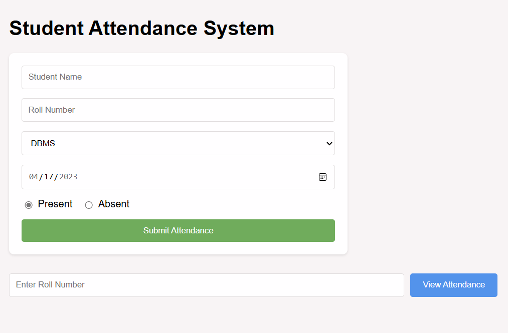

# 🎓 Student Attendance System

A personal full-stack web application to track and manage your course-wise attendance. Built using **React (Vite)** for the frontend and **Node.js + Express + MongoDB** for the backend, this app ensures accurate tracking with smart validations and an intuitive interface.

---

## ✨ Features

- 📝 Submit attendance with student name, roll number, course, date, and status
- 🚫 Prevents double attendance entries for the same date and course
- 📅 Disables weekends — shows popup: _"No classes on weekends"_
- 📊 View attendance percentage by entering roll number
- ⚙️ Fully connected frontend and backend with MongoDB database

---

## 💡 Benefits

- 🎯 Helps you **track your own attendance** precisely across multiple courses
- ✅ Ensures **data integrity** with validations against duplicate entries and weekends
- 📅 The **backend restricts attendance to valid semester dates**, preventing accidental errors outside the academic window
- 📊 Makes it easy to **monitor attendance against college’s 80% criteria**
- 🧠 Enhances understanding of **full-stack development** with practical logic
- 🛠️ Can be expanded into a **multi-user or institutional tracking system**

 ---

## 🖼️ UI Preview



---

## 🚀 Tech Stack

| Layer       | Tech                         |
|-------------|------------------------------|
| Frontend    | React + Vite, CSS            |
| Backend     | Node.js + Express            |
| Database    | MongoDB + Mongoose           |
| Tools       | Git, GitHub, VS Code         |

---

## 📂 Project Structure

```plaintext
student-attendance-system/
├── client/                   # Frontend (React + Vite)
│   ├── public/               # Static files
│   ├── src/                  # React components
│   ├── routes/               # Frontend routes (if any)
│   ├── controllers/          # Optional frontend logic
│   ├── models/               # Optional frontend models
│   ├── config/               # Frontend config (if needed)
│   ├── index.html            # App HTML root
│   ├── index.js              # Entry point
│   └── vite.config.js        # Vite configuration
│
├── server/                   # Backend (Node.js + Express)
│   ├── models/               # Mongoose schemas
│   ├── controllers/          # Business logic handlers
│   ├── routes/               # API endpoints
│   ├── config/               # DB connection logic
│   ├── .env                  # Environment variables
│   └── index.js              # Server entry point
│
├── .gitignore
├── README.md
└── package.json
